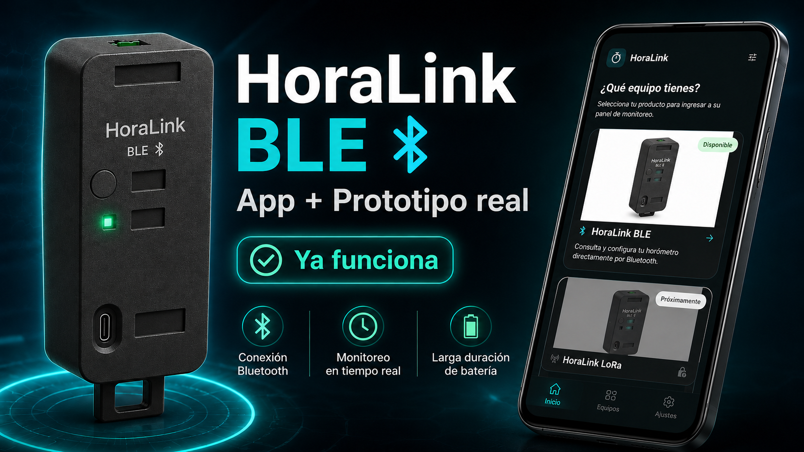
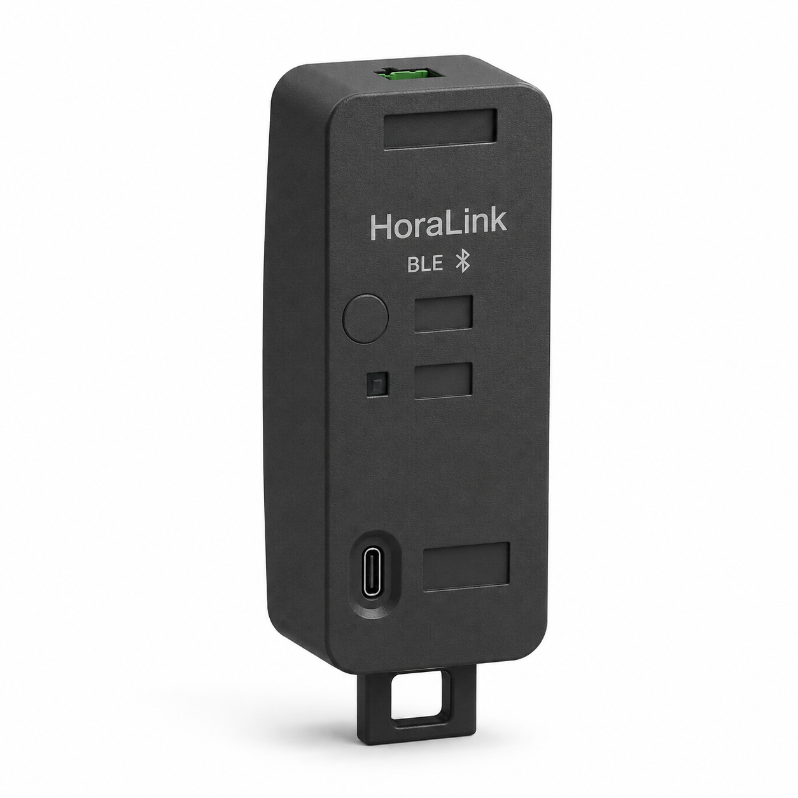
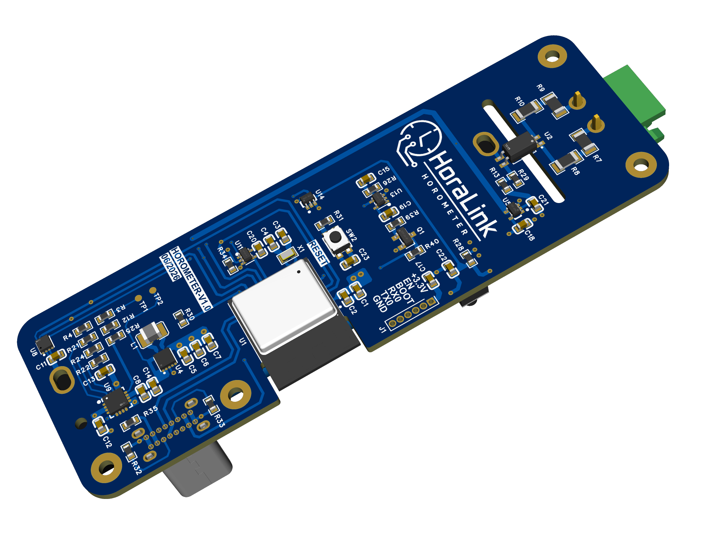
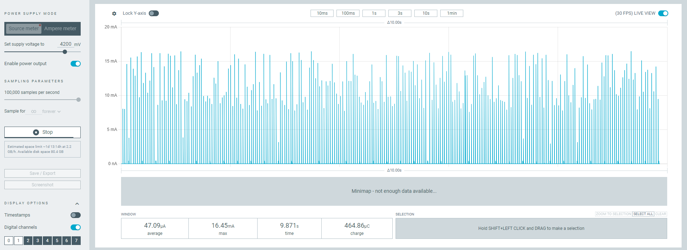
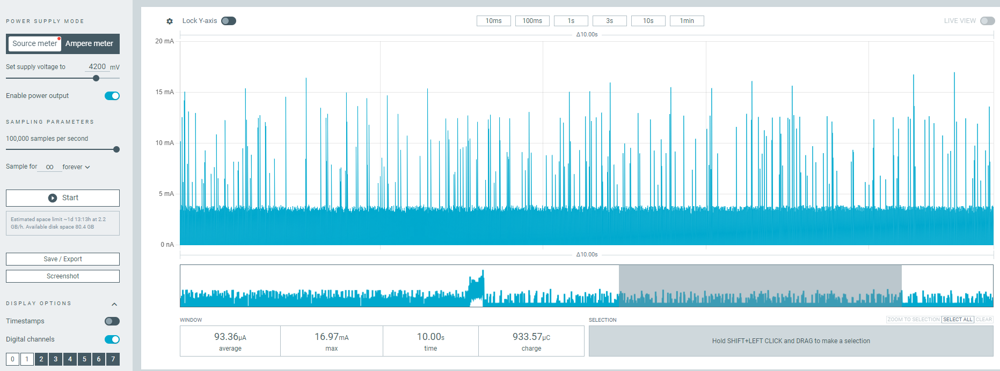
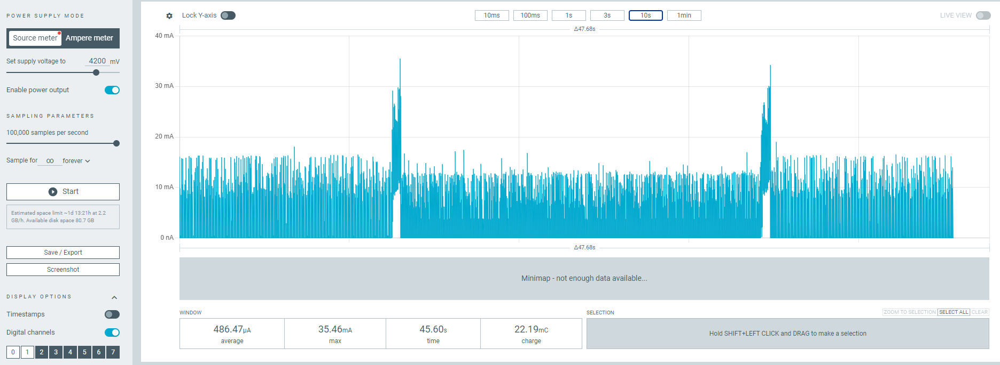

# HoraLink V1



HoraLink es un horómetro autónomo de un canal basado en ESP32-C3. Registra en
memoria no volátil el tiempo durante el cual permanece activo el equipo
monitoreado, funciona normalmente en deep sleep y entrega la lectura a una
aplicación Android mediante publicidad BLE y permite una configuración GATT
temporal autorizada con el botón físico.

## Estructura del proyecto

| Carpeta | Contenido |
|---|---|
| `horalink_V1_esp32c3` | Firmware ESP-IDF 5.5.4 para el ESP32-C3 |
| `app_horalink_flutter` | Aplicación Flutter para Android |

## Familia de productos en la aplicación

La aplicación móvil presenta un selector de producto durante el primer inicio:

- **HoraLink BLE** abre el tablero, la lectura de publicidad y la configuración
  GATT implementadas actualmente.
- **HoraLink LoRa** aparece identificado como **Próximamente** y queda preparado
  para incorporar su flujo cuando el hardware y el protocolo estén terminados.

La selección BLE se recuerda localmente. Desde el icono de cuadrícula del
tablero se puede volver al selector sin borrar los datos del horómetro.

## Funcionamiento general

1. GPIO6 refleja el estado estable del canal: `LOW` apagado y `HIGH` activo.
2. Cada cambio genera en GPIO4 un pulso ascendente de aproximadamente 36 ms.
3. GPIO4 despierta al ESP32-C3, que verifica GPIO6 y actualiza el registro NVS.
4. Mientras el canal está activo, el tiempo se calcula usando el reloj RTC y
   el cristal externo de 32.768 kHz.
5. GPIO5 despierta el equipo por una pulsación manual.
6. Al despertar por GPIO5 se lee el MAX17048 y se publican por BLE durante 10
   segundos el tiempo acumulado, la batería y el estado del canal.
7. La aplicación puede conectarse dentro de esa ventana para cambiar el nombre
   o solicitar un reinicio del horómetro.
8. Una conexión amplía la sesión hasta 60 segundos. El reinicio requiere una
   segunda pulsación física dentro de 15 segundos.
9. Al finalizar, NimBLE se detiene y el ESP32-C3 vuelve a deep sleep.

Durante los 10 segundos de publicidad el firmware continúa vigilando GPIO6.
Si el canal cambia en esa ventana, la transición también se procesa y se guarda
en NVS.

## Hardware utilizado

<table>
  <tr>
    <td align="center" width="50%">
      
      <br>
      <strong>Prototipo HoraLink BLE</strong>
    </td>
    <td align="center" width="50%">
      
      <br>
      <strong>PCB HoraLink BLE — vista superior</strong>
    </td>
  </tr>
</table>

| Dispositivo o señal | Conexión |
|---|---|
| Cristal RTC de 32.768 kHz | GPIO0 y GPIO1 |
| MAX17048 | I2C `0x36`, SDA GPIO2, SCL GPIO8 |
| Alimentación portátil | Batería de 3000 mAh con carga USB en la PCB |
| Pulso de cambio del canal | GPIO4, activo en HIGH |
| Botón de consulta | GPIO5, activo en HIGH |
| Estado del canal 1 | GPIO6 |

SDA y SCL requieren pull-up externos a 3.3 V. Los pull-up internos del ESP32-C3
están desactivados en el firmware.

## Consumo medido

Las mediciones se realizaron a 4.2 V pocos segundos después de entrar en
deep sleep. El consumo estable depende del estado eléctrico del canal:

| Condición | Captura | Valor de referencia |
|---|---:|---:|
| Canal apagado, deep sleep | 47.09 µA | 47 µA |
| Canal encendido, deep sleep | 93.36 µA en la captura inicial | 110 µA conservadores después de repetir la medición |
| Despertar por transición | Picos de aproximadamente 20 a 35 mA | Evento transitorio, no consumo permanente |

<p align="center">
  
  
</p>

La siguiente captura muestra la secuencia completa: PCB energizada con el canal
apagado, encendido del canal y posterior apagado. Los bloques de corriente alta
corresponden al arranque del ESP32-C3 para procesar y guardar cada transición;
después de cada evento el equipo vuelve a deep sleep.



### Estimación de autonomía

La batería instalada tiene una capacidad nominal de 3000 mAh. Para evitar una
estimación optimista se reserva el 30 % de esa capacidad:

```text
Capacidad útil = 3000 mAh × 0.70 = 2100 mAh
```

Si `D` es la fracción de tiempo durante la cual el canal permanece encendido,
el consumo medio de deep sleep se aproxima mediante:

```text
I_promedio = 47 × (1 − D) + 110 × D  [µA]
Autonomía = 2100 / (I_promedio / 1000) / 24 / 365.25  [años]
```

| Tiempo con el canal encendido | Consumo medio estimado | Autonomía teórica |
|---:|---:|---:|
| 0 % | 47.00 µA | 5.10 años |
| 25 % | 62.75 µA | 3.82 años |
| 50 % | 78.50 µA | 3.05 años |
| 75 % | 94.25 µA | 2.54 años |
| 100 % | 110.00 µA | 2.18 años |

Estas cifras ya utilizan únicamente los **2100 mAh útiles**. Son estimaciones
teóricas del consumo estable y no incluyen autodescarga, envejecimiento,
temperatura, variaciones entre baterías, pérdidas del circuito de alimentación,
despertares por transiciones ni sesiones BLE de consulta/configuración. La
autonomía real será menor y deberá validarse con una prueba prolongada del
prototipo.

## Datos BLE

HoraLink utiliza Service Data con UUID:

```text
7e57d004-2b97-0e7a-e511-9b9941e4a8f2
```

La trama incluye versión del protocolo, estado del canal, validez de batería,
porcentaje, voltaje en milivoltios y tiempo acumulado en segundos. La
publicidad legacy cabe en los 31 bytes disponibles. Es conectable únicamente
durante la sesión física abierta mediante GPIO5.

## Inicio rápido

Firmware:

```text
cd horalink_V1_esp32c3
idf.py fullclean
idf.py reconfigure
idf.py build
idf.py -p PUERTO_SERIE flash monitor
```

`PUERTO_SERIE` debe reemplazarse por el puerto asignado en cada computadora;
por ejemplo, `COM7` en Windows, `/dev/ttyUSB0` en Linux o
`/dev/cu.usbserial-*` en macOS. Si solo hay un dispositivo compatible
conectado, ESP-IDF también puede detectarlo al ejecutar
`idf.py flash monitor` sin indicar `-p`.

Aplicación Android:

```text
cd app_horalink_flutter
flutter pub get
flutter run
```

Consulta los README de cada carpeta para conocer la compilación, estructura,
trama BLE y secuencia de pruebas con mayor detalle.
