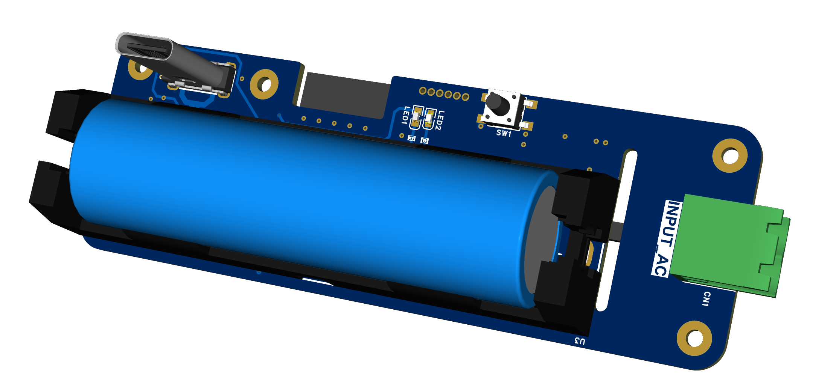
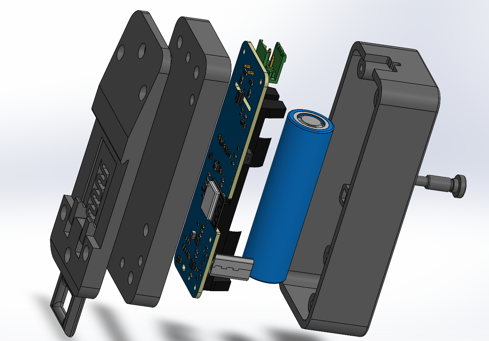

# Firmware HoraLink V1 para ESP32-C3

Firmware desarrollado con ESP-IDF 5.5.4 para un horómetro de un canal de bajo
consumo. Mantiene el ESP32-C3 en deep sleep, conserva el tiempo mediante el RTC
con cristal externo, guarda las transiciones en NVS y transmite una instantánea
por publicidad BLE cuando se pulsa el botón.

## Hardware y PCB

La PCB integra el ESP32-C3, el cristal RTC externo de 32.768 kHz, el monitor de
batería MAX17048, la entrada aislada del canal, el pulsador de consulta, la
carga USB y el soporte para una batería de 3000 mAh.

<table>
  <tr>
    <td align="center" width="50%">
      
      <br>
      <strong>Vista superior</strong>
    </td>
    <td align="center" width="50%">
      
      <br>
      <strong>Vista inferior y batería</strong>
    </td>
  </tr>
</table>

### Vista explotada del ensamble

La vista explotada muestra la relación entre las dos piezas de la carcasa, la
PCB, la batería y los elementos mecánicos de fijación.

<p align="center">
  
</p>

## Mapa de pines

| Señal de la PCB | Pin | Dirección | Función |
|---|---:|---|---|
| `XTAL-32K_P` | GPIO0 | Cristal | Oscilador RTC externo de 32.768 kHz |
| `XTAL-32K_N` | GPIO1 | Cristal | Oscilador RTC externo de 32.768 kHz |
| `SDA/I2C` | GPIO2 | Bidireccional | Datos del MAX17048 |
| `CH1/RTC` | GPIO4 | Entrada | Pulso HIGH de 36 ms; despierta por cambio de canal |
| `BUTTON/RTC` | GPIO5 | Entrada | Botón activo en HIGH; inicia la consulta BLE |
| `STATE-CH1` | GPIO6 | Entrada | Estado estable: `0` apagado, `1` funcionando |
| `SCL/I2C` | GPIO8 | Salida | Reloj I2C del MAX17048 |

GPIO4, GPIO5 y GPIO6 son manejados por la electrónica de la PCB, por lo que el
firmware no habilita resistencias internas. El bus I2C utiliza los pull-up
externos de SDA y SCL a 3.3 V.

ESP-IDF muestra el siguiente aviso siempre que
`enable_internal_pullup = false`:

```text
i2c.master: Please check pull-up resistances whether be connected properly.
```

Es informativo; no indica una falla cuando los pull-up externos están montados
y el MAX17048 responde correctamente.

## Secuencia del horómetro

### Arranque inicial

El firmware configura las entradas, inicializa NVS, lee GPIO6 y crea el primer
registro si todavía no existe. Luego configura GPIO4 y GPIO5 como fuentes de
despertar por nivel alto y entra en deep sleep.

### Canal apagado a encendido

1. GPIO6 cambia de `0` a `1`.
2. GPIO4 genera un pulso HIGH y despierta al ESP32-C3.
3. El firmware compara GPIO6 con el último estado almacenado.
4. Guarda en NVS el instante inicial de la sesión y el nuevo estado.
5. Regresa a deep sleep.

### Canal encendido a apagado

1. GPIO6 cambia de `1` a `0`.
2. GPIO4 despierta al ESP32-C3.
3. Se calcula la duración desde el instante inicial de la sesión.
4. La duración se suma al tiempo acumulado.
5. Se guardan el estado apagado, el acumulado y el contador de transiciones.
6. El equipo regresa a deep sleep.

### Pulsación del botón

1. GPIO5 despierta al ESP32-C3.
2. Se calcula el tiempo efectivo, incluyendo una sesión actualmente activa.
3. Se leen `VCELL` y `SOC` del MAX17048 en la dirección I2C `0x36`.
4. NimBLE inicia publicidad legacy conectable durante 10 segundos.
5. GPIO6 se muestrea cada 20 ms; un cambio requiere tres muestras iguales para
   ser aceptado y guardado.
6. Si la app se conecta, la sesión se amplía hasta 60 segundos y habilita el
   servicio GATT de configuración.
7. Se detiene BLE, se libera NimBLE y se espera que GPIO4/GPIO5 regresen a LOW.
8. El ESP32-C3 entra nuevamente en deep sleep.

## Registro NVS

El namespace `horometer` contiene un único blob versionado con:

| Campo | Tipo | Descripción |
|---|---|---|
| `last_state` | `uint8_t` | Último estado confirmado de GPIO6 |
| `session_start_ms` | `int64_t` | Instante RTC de inicio de la sesión activa |
| `accumulated_ms` | `uint64_t` | Tiempo finalizado acumulado en milisegundos |
| `transition_count` | `uint32_t` | Número de transiciones confirmadas |

La flash solamente se escribe al crear el registro, corregir una sesión cuyo
RTC se haya reiniciado, confirmar una transición, cambiar el nombre o confirmar
físicamente un reinicio. El nombre se guarda por separado en el namespace
`device_cfg`, por lo que reiniciar las horas no lo elimina.

## MAX17048

El driver usa la API I2C master de ESP-IDF a 100 kHz:

| Registro | Dirección | Conversión |
|---|---:|---|
| `VCELL` | `0x02` | Valor de 12 bits, 1.25 mV por LSB desplazado |
| `SOC` | `0x04` | Porcentaje ModelGauge, 1/256 % por LSB |

El porcentaje publicado proviene del cálculo SOC interno del MAX17048. También
se transmite el voltaje para diagnóstico. Si falla la lectura I2C, la
publicidad continúa con la bandera de batería no válida.

## Trama de publicidad BLE

UUID de Service Data:

```text
7e57d004-2b97-0e7a-e511-9b9941e4a8f2
```

Payload HoraLink de 10 bytes:

| Byte(s) | Campo | Formato |
|---:|---|---|
| 0 | Versión | Actualmente `1` |
| 1 | Banderas | Bit 0: canal activo; bit 1: batería válida |
| 2 | Batería | Porcentaje `0..100`; `0xFF` si no es válido |
| 3–4 | Voltaje | Milivoltios, `uint16` little-endian |
| 5–9 | Horómetro | Segundos acumulados, entero de 40 bits little-endian |

La publicidad se repite aproximadamente cada 100–120 ms y utiliza
`BLE_GAP_CONN_MODE_UND`. La conexión solo está disponible después de GPIO5;
no se conserva un emparejamiento permanente.

## Servicio GATT de configuración

| Elemento | UUID | Operaciones |
|---|---|---|
| Servicio HoraLink | `7e57d004-2b97-0e7a-e511-9b9941e4a8f2` | Descubrimiento |
| Nombre | `7e57d005-2b97-0e7a-e511-9b9941e4a8f2` | Lectura y escritura UTF-8 |
| Reinicio | `7e57d006-2b97-0e7a-e511-9b9941e4a8f2` | Escritura de solicitud y lectura de estado |

Estados de reinicio: `0` inactivo, `1` esperando botón físico, `2` completado y
`3` expirado. La orden GATT solo deja el reinicio pendiente; el borrado se
ejecuta cuando GPIO5 vuelve a producir un flanco ascendente dentro de 15
segundos. El nuevo registro parte del estado actual de GPIO6, conserva el nombre
y no borra la partición NVS completa.

## Estructura del código

```text
main/
├── main.c
└── app/
    ├── ble/horalink_ble.c
    ├── board/board_pins.h
    ├── drivers/max17048/max17048.c
    ├── horometer/horometer_app.c
    ├── storage/device_config_storage.c
    └── storage/horometer_storage.c
```

## Configuración y compilación

Requisitos:

- ESP-IDF 5.5.4.
- Target `esp32c3`.
- Flash de 4 MB.
- Cristal RTC externo de 32.768 kHz.

Compilar:

```text
idf.py fullclean
idf.py reconfigure
idf.py build
```

`fullclean` elimina los artefactos de una compilación anterior y `reconfigure`
regenera la configuración de CMake para el entorno ESP-IDF instalado. Se
recomienda ejecutar ambos comandos después de clonar el repositorio, cambiar de
versión de ESP-IDF o mover el proyecto entre computadoras. No es necesario
repetirlos antes de cada compilación normal; después puede utilizarse solamente
`idf.py build`.

Grabar y abrir el monitor:

```text
idf.py -p PUERTO_SERIE flash monitor
```

Reemplaza `PUERTO_SERIE` por el puerto real de la placa, por ejemplo:

```text
# Windows
idf.py -p COM7 flash monitor

# Linux
idf.py -p /dev/ttyUSB0 flash monitor

# macOS
idf.py -p /dev/cu.usbserial-0001 flash monitor
```

En Windows puede consultarse en **Administrador de dispositivos → Puertos
(COM y LPT)**. En Linux y macOS puede compararse la lista de dispositivos
serie antes y después de conectar la placa. Si ESP-IDF detecta una sola placa,
también puede intentarse `idf.py flash monitor` sin el parámetro `-p`.

La compilación verificada genera `build/horalink_V1_esp32c3.bin`. La tabla de
particiones contiene NVS, `otadata`, dos slots OTA de 1856 KiB, `phy_init` y
una partición SPIFFS de 256 KiB.

## Mediciones de referencia

En la PCB probada, alimentada a 4.2 V y medida después de entrar en deep sleep,
se observaron aproximadamente 47 µA con el canal apagado y 110 µA con el canal
encendido. Son valores experimentales de referencia; pueden variar con la
placa, temperatura, instrumento, estado del MAX17048 y componentes externos.

## Prueba recomendada

1. Enciende la PCB con GPIO6 en LOW y confirma la entrada a deep sleep.
2. Activa el canal y verifica el registro del instante inicial.
3. Desactiva el canal y verifica la duración y el acumulado.
4. En la aplicación móvil pulsa **Buscar HoraLink**.
5. Pulsa el botón físico GPIO5.
6. Abre **Configurar HoraLink** antes de que finalicen los 10 segundos.
7. Prueba el cambio de nombre y confirma que vuelve a aparecer en la app.
8. Solicita reiniciar el contador, acepta el diálogo y pulsa nuevamente GPIO5.
9. Confirma que la app muestra cero y que el nombre se conserva.
